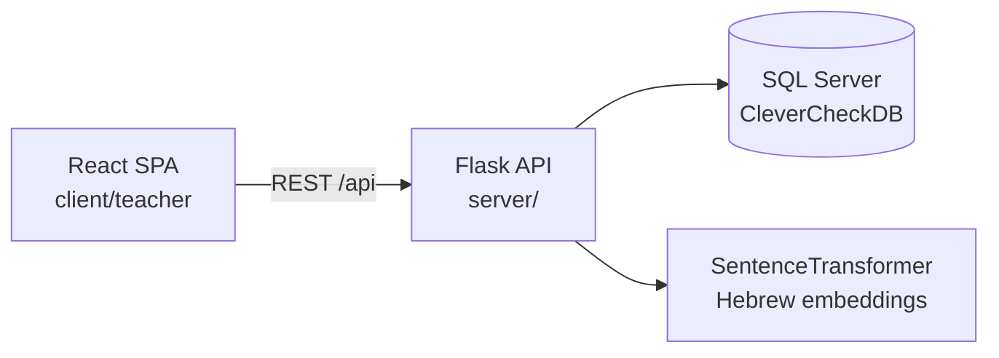

# CleverCheck

Automated exam grading platform for the Israeli education system — teachers create exams, students submit answers, and the system grades responses using Hebrew NLP.

## Features

### Teacher Portal
- **Exam management** — create, edit, delete exams with multiple question types (multiple‑choice, open‑ended, true/false, numeric)
- **Question bank** — attach options to multiple‑choice questions, set correct answers, assign scores
- **Class & student management** — CRUD for classes, students, and teachers (admin only)
- **Subject management** — organise exams by subject
- **Results dashboard** — view per‑student scores, per‑question breakdown, and exam statistics
- **Role‑based access** — `admin` can manage all teachers/students/subjects; `teacher` sees only their own exams

### Student Portal (scaffold)
- Mock endpoints for listing exams and submitting answers (backend shell exists, frontend not yet built)

### Automated Grading (NLP)
- Keyword extraction from teacher model answers using KeyBERT
- Semantic similarity scoring via SentenceTransformer embeddings
- Hebrew synonym detection via Reverso.net
- Negation detection to flag contradictory answers
- Spelling correction via Scribens.fr

## Architecture



The backend follows a **Repository → Service → Controller** layered pattern with DTOs for input validation. The frontend uses **React Context** for auth state and **React Router** for navigation with route guards.

## Tech Stack

| Layer | Technology |
|---|---|
| **Frontend** | React 19, TypeScript 6, Vite 8, MUI 5, React Router 6, Axios |
| **Backend** | Python 3, Flask 3, SQLAlchemy 2, PyJWT |
| **Database** | SQL Server (via pyodbc + SQLAlchemy) |
| **ML / NLP** | Sentence‑Transformers, KeyBERT, torch, BeautifulSoup4 |
| **Testing** | pytest, pytest‑cov (backend) |
| **Validation** | Zod, react‑hook‑form (frontend) |

## Project Structure

```
CleverCheck/
├── server/                          # Flask backend
│   ├── app.py                       # Application entry point, blueprint registration
│   ├── config.py                    # Environment configuration (SECRET_KEY)
│   ├── db_connection.py             # SQLAlchemy engine & session factory
│   ├── requirements.txt             # Python dependencies
│   ├── pytest.ini                   # Pytest configuration
│   ├── controllers/                 # Flask Blueprints (one per resource)
│   │   ├── exams_controller.py
│   │   ├── students_controller.py
│   │   ├── teachers_controller.py
│   │   ├── subject_controller.py
│   │   ├── teacher_auth_controller.py
│   │   └── ...
│   ├── models/                      # SQLAlchemy ORM models
│   │   ├── base.py
│   │   ├── exams.py
│   │   ├── questions.py
│   │   ├── student.py
│   │   └── ...
│   ├── repositories/                # Data access layer
│   ├── services/                    # Business logic
│   │   ├── auth_service.py
│   │   ├── grading_service.py       # NLP grading engine
│   │   ├── check_answer_service.py  # CleverCheck answer evaluator
│   │   ├── jwt_service.py           # Student JWT
│   │   ├── jwt_teacher_service.py   # Teacher JWT
│   │   ├── Synonym_reverso.py       # Hebrew synonym scraping
│   │   ├── correction_answer_scribens.py  # Hebrew spell checking
│   │   └── main_service/           # Additional NLP pipelines
│   ├── dtos/                        # Data Transfer Objects
│   ├── middleware/                   # JWT authentication decorator
│   ├── exceptions/                  # Custom exceptions + error handlers
│   └── tests/                       # pytest test suite
│
├── client/
│   └── teacher/                     # React SPA (teacher/admin portal)
│       ├── package.json
│       ├── vite.config.ts           # Dev server + API proxy config
│       ├── tsconfig.json
│       ├── index.html
│       └── src/
│           ├── main.tsx             # React entry point
│           ├── App.tsx              # Route definitions
│           ├── theme.ts             # MUI theme (RTL, orange primary)
│           ├── config.ts            # Environment variables
│           ├── api/                 # Axios HTTP client + endpoint modules
│           ├── models/              # TypeScript type definitions
│           ├── context/             # AuthContext provider
│           ├── components/          # Shared UI (Layout, RouteGuard, BackButton)
│           └── pages/               # Page components
└── .gitignore
```

## Installation

### Prerequisites
- Python 3.10+
- Node.js 20+
- SQL Server instance with ODBC Driver 17
- A Sentence‑Transformer model placed in `server/my_model/` (Hebrew‑compatible, e.g., `alephbert` or `dictabert`)

### Backend

```bash
cd server
python -m venv .venv
source .venv/bin/activate   # Windows: .venv\Scripts\activate
pip install -r requirements.txt
```

### Frontend

```bash
cd client/teacher
npm install
```

### Database

1. Create a SQL Server database named `CleverCheckDB`.
2. Create a SQL login `gradex_user` with password `Gradex123!` (or update `server/db_connection.py`).
3. Tables are created automatically on first run via `Base.metadata.create_all()`.

### ML Model

Place a Sentence‑Transformer model directory at `server/my_model/`. The model must support Hebrew text. Example:

```bash
python -c "from sentence_transformers import SentenceTransformer; SentenceTransformer('imvladikon/alephbertgimmel-base-512').save('server/my_model')"
```

## Configuration

| Variable | File | Purpose |
|---|---|---|
| `SECRET_KEY` | `.env` / environment | JWT signing key (required) |
| `DB_SERVER` | `db_connection.py` | SQL Server host (hardcoded: `192.168.43.13`) |
| `DB_NAME` | `db_connection.py` | Database name (hardcoded: `CleverCheckDB`) |
| `VITE_SERVER_URL` | `client/teacher/.env` | Optional backend URL override |

The database credentials are currently hardcoded in `server/db_connection.py`. In production, these should be moved to environment variables.

## Running the Project

### Development

Start both servers concurrently:

```bash
# Terminal 1 — backend
cd server
python app.py
# Flask runs on http://localhost:5000

# Terminal 2 — frontend
cd client/teacher
npm run dev
# Vite dev server on http://localhost:5174, proxies /api → localhost:5000
```

### Production Build (Frontend)

```bash
cd client/teacher
npm run build    # outputs to dist/
npm run preview  # preview the production build
```

### Tests

```bash
cd server
pytest                          # run all tests
pytest --cov=server --cov-report=html  # with coverage report
```

### Linting

```bash
cd client/teacher
npm run lint
```

## API

All endpoints are prefixed with `/api`. Authentication is via HTTP‑only JWT cookie.

### Authentication

| Method | Endpoint | Auth | Description |
|---|---|---|---|
| POST | `/api/auth/login` | No | Student login |
| GET | `/api/auth/me` | Yes | Get current student |
| POST | `/api/auth_teacher/login` | No | Teacher login |
| GET | `/api/auth_teacher/me` | Yes | Get current teacher |

**Teacher login example:**

```json
POST /api/auth_teacher/login
{ "username": "123456789", "password": "mypassword" }

Response 200:
{
  "id": 123456789,
  "role": "teacher",
  "first_name": "ישראל",
  "last_name": "ישראלי"
}
```

### Exams

| Method | Endpoint | Auth | Description |
|---|---|---|---|
| GET | `/api/exams` | Teacher/Admin | List exams (filtered by role) |
| GET | `/api/exams/stats` | Teacher/Admin | Exam statistics summary |
| POST | `/api/exams` | Teacher/Admin | Create exam |
| GET | `/api/exams/teacher/<id>` | Teacher/Admin | Exam detail with student answers |
| GET | `/api/exams/<id>` | Student | Student exam view |
| PUT | `/api/exams/<id>` | Teacher/Admin | Update exam |
| DELETE | `/api/exams/<id>` | Teacher/Admin | Delete exam |

### Other Resource Endpoints

All follow RESTful CRUD patterns (`GET /`, `GET /<id>`, `POST /`, `PUT /<id>`, `DELETE /<id>`):

`/api/students`, `/api/teachers`, `/api/subjects`, `/api/classes`, `/api/questions`, `/api/options`, `/api/question_types`, `/api/student_answers`, `/api/teacher_answers`, `/api/student_exams`

## Database

**Engine**: SQL Server accessed via SQLAlchemy 2.x ORM with pyodbc.

**Schema**: 14 tables modelling the exam lifecycle:

```mermaid
erDiagram
    Teacher ||--o{ Exam : creates
    Exam ||--o{ Question : contains
    Question ||--o{ Option : has
    Question ||--o| TeacherAnswer : "correct answer"
    Question }o--|| QuestionType : "typed as"
    Exam }o--|| Subject : "belongs to"
    Exam }o--o{ Class : "assigned via ExamClass"
    Teacher }o--o{ Class : "teaches via TeacherClass"
    Student }o--|| Class : "enrolled in"
    Exam ||--o{ StudentExam : "student attempts"
    Student ||--o{ StudentExam : "attempts"
    StudentExam ||--o{ StudentAnswer : "answers"
    Question ||--o{ StudentAnswer : answered_in
```

**No migration tool** is configured. `Base.metadata.create_all()` is available for development. Use Alembic for production schema management.

## Testing

Backend tests use pytest with fixtures in `server/tests/conftest.py`. Current test files:

| File | Coverage |
|---|---|
| `test_grading_controller.py` | Grading endpoints |
| `test_grading_repository.py` | Grading data layer |
| `test_student_client_api.py` | Student client endpoints |

```bash
cd server
pytest -v
```

Frontend tests are not yet configured.

## Security

- **Authentication**: JWT (HS256) stored in HTTP‑only cookies with `samesite=Lax`
- **Password hashing**: `werkzeug.security.generate_password_hash` / `check_password_hash`
- **Route protection**: `@before_request` middleware checks JWT cookie on all non‑public routes; `RouteGuard` component on frontend
- **Role enforcement**: Admin‑only routes protected both on the API (role check in JWT) and frontend (`allowedRoles` prop)
- **CORS**: Restricted to `http://localhost:5174`

### Known Security Gaps
- `secure=False` on cookies (must be `True` with HTTPS in production)
- Database credentials hardcoded in `db_connection.py`
- No rate limiting on login endpoints
- No CSRF protection beyond SameSite cookies

## Performance

- **Model loading** is lazy with thread‑safe singleton (`embedding_service.py`)
- **Frontend** uses Vite with code splitting potential (not yet implemented per‑route)
- **No caching layer** — all requests hit SQL Server directly
- **No background job queue** — grading is synchronous

## Development Notes

- The UI displays "Gradex" branding but the backend and repository use "CleverCheck" — this inconsistency should be resolved.
- `student_client_controller.py` returns hardcoded mock data and needs to be wired to the actual service layer.
- The `GradingService` and `CleverCheckService` are implemented but the grading blueprint is commented out in `app.py`. The auto‑grading pipeline is functional at the class level but not yet integrated into the exam submission flow.
- `server/db_connection_test.py` is an older/alternate connection module — `db_connection.py` is the active one.
- `generate_repositories.py` and `generate_services.py` are code‑generation scripts used during development scaffolding.
- The ML model at `server/my_model/` is git‑ignored — each developer must provide their own Hebrew Sentence‑Transformer model.
- `Synonym_reverso.py` exists in two locations; consider consolidating.

## Contributing

1. Create a branch from `main`.
2. Follow the existing layered architecture (Repository → Service → Controller for backend; api → context → pages for frontend).
3. Write tests for new endpoints.
4. Use Hebrew for user‑facing strings, English for code identifiers.
5. Ensure the frontend works in RTL mode.

## License

No license is specified in the repository.
